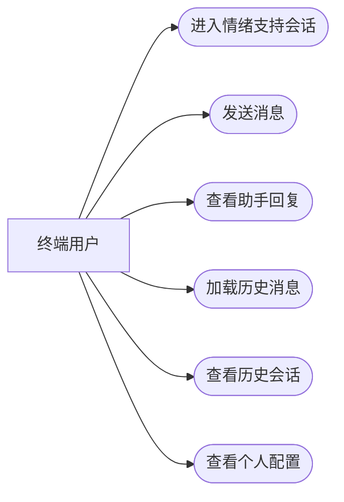
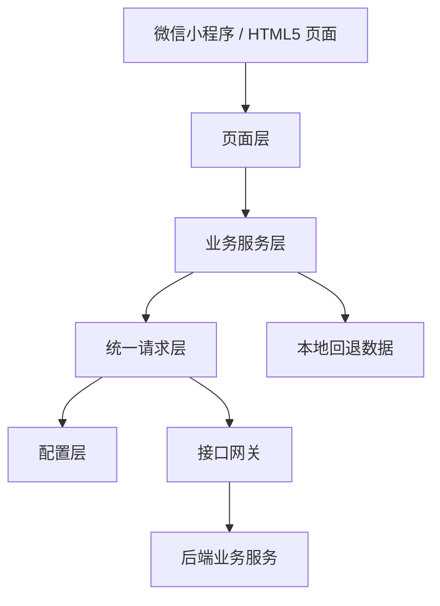
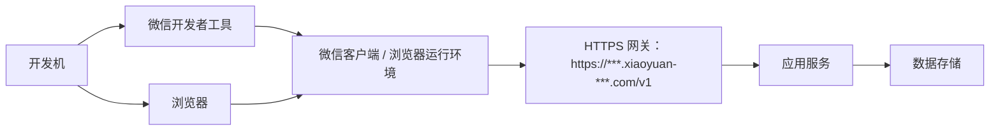
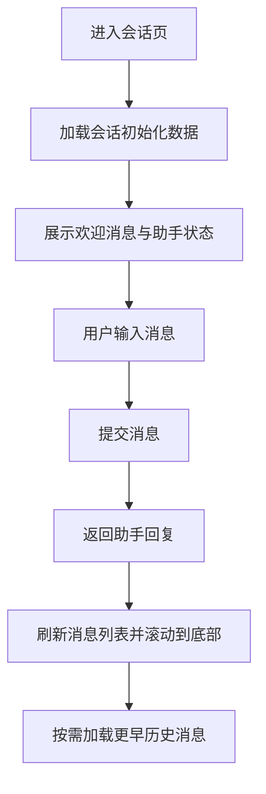
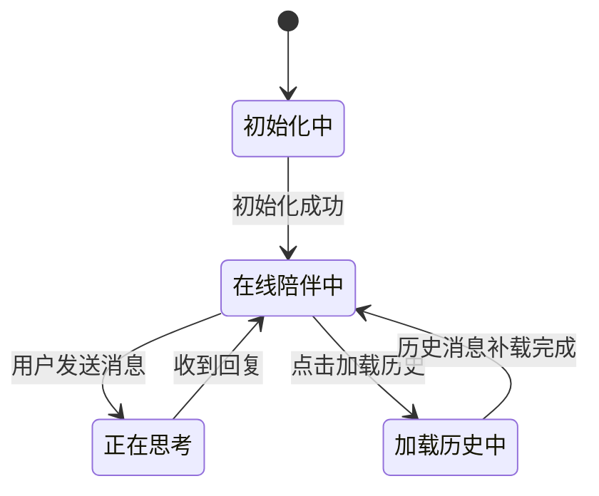
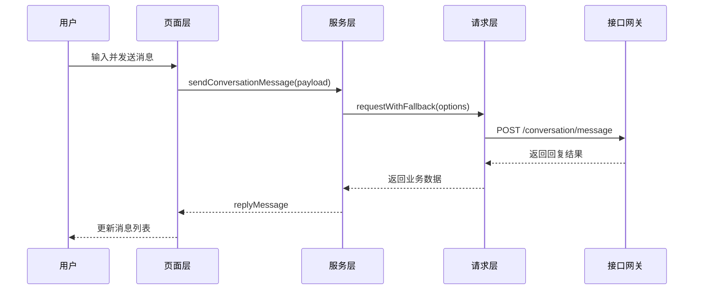
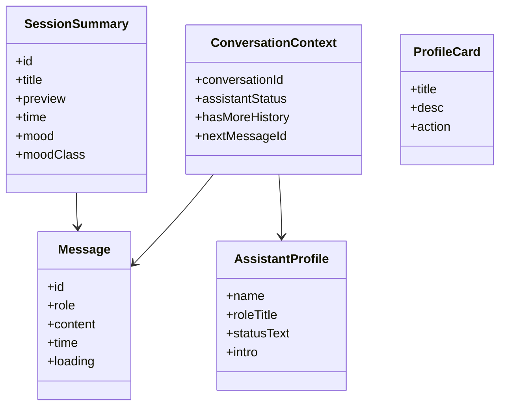

# 小元癌症情绪支持交互软件设计说明书

版本：V1.0

## 1 引言

小元癌症情绪支持交互软件是一套面向癌症情绪支持场景的前端交互软件，围绕用户会话沟通、历史记录浏览、个人偏好管理和支持资源触达等功能展开。当前仓库同时包含微信小程序主工程与 HTML5 展示页，两者在页面结构、接口调用边界和交互行为上保持一致。本说明书以当前代码仓库中的已核验事实为基础，描述软件的总体结构、功能模块、数据对象、接口设计、运行方式和验证情况。

## 2 需求分析

### 2.1 建设目标

本软件旨在为癌症相关情绪支持场景提供一个轻量、可持续陪伴的交互入口。用户进入系统后，可以直接发起情绪支持会话，查看近期会话摘要，管理个人偏好和支持配置，并通过统一页面入口快速获得稳定的情绪陪伴服务。软件强调低学习成本、柔和界面风格、连续会话体验和可扩展的服务对接能力。

### 2.2 功能需求

| 功能分类 | 功能项 | 功能说明 |
| --- | --- | --- |
| 会话服务 | 会话初始化 | 进入会话页时加载会话编号、助手资料、欢迎消息和历史标识 |
| 会话服务 | 消息发送 | 用户输入文本后提交消息并接收助手回复 |
| 会话服务 | 历史消息补载 | 通过“加载历史”入口继续查看更早消息 |
| 历史管理 | 历史会话浏览 | 展示历史会话摘要、时间和情绪标签 |
| 个人服务 | 配置卡片展示 | 展示会话偏好、紧急支持、消息与提醒等配置入口 |
| 公共能力 | 页面切换 | 通过底部导航在会话、历史、我的三页之间切换 |

### 2.3 非功能需求

| 类别 | 要求 |
| --- | --- |
| 易用性 | 页面结构清晰，信息密度适中，用户可快速识别主要操作入口 |
| 稳定性 | 在接口异常时可切换到本地回退数据，保证页面仍可正常展示 |
| 可维护性 | 采用配置层、请求层、服务层、页面层分离结构，便于后续扩展 |
| 兼容性 | 支持微信小程序运行，也支持在浏览器中运行 HTML5 展示页 |
| 安全性 | 软著材料中的接口网关、域名和网络地址统一脱敏处理 |

## 3 系统概述

软件由展示层、调用层、服务层和回退数据层构成。展示层包含微信小程序页面和 HTML5 页面；调用层负责统一网络请求；服务层面向会话、历史和个人配置三个业务域；回退数据层在无后端或接口异常时提供稳定演示数据。当前软件以情绪支持会话为主线，将历史摘要和个人配置作为辅助功能组织在同一交互体系中。

## 4 总体设计

### 4.1 用例图

图 4-1 说明了终端用户与系统之间的主要功能关系。用户围绕会话沟通展开核心操作，并可进一步查看历史摘要与个人配置。

### 4.2 系统架构图

图 4-2 展示了软件的整体技术结构。页面层不直接拼接接口地址，而是通过服务层和请求层访问后端；当接口不可用时，服务层可回退到本地数据。

### 4.3 部署图

图 4-3 说明软件既可在微信小程序容器中运行，也可通过浏览器访问 HTML5 展示页，二者均通过统一网关连接后端服务。

## 5 详细设计

### 5.1 会话流程

图 5-1 描述了会话页的主要业务流程。系统先完成初始化，再处理用户发送消息和历史消息补载，形成连续会话体验。

### 5.2 页面状态设计

图 5-2 反映了会话页的主要状态切换逻辑。页面状态由初始化、消息发送和历史补载等行为驱动。

### 5.3 消息发送时序

图 5-3 展示了消息发送链路。页面层只处理交互和渲染，网络访问与回退逻辑由请求层和服务层统一承担。

### 5.4 页面结构设计

#### 5.4.1 会话页

会话页由顶部助手信息区、中部消息滚动区和底部输入区组成。顶部区域用于展示助手名称、角色和在线状态；中部区域展示欢迎消息、历史补载入口和会话消息；底部区域提供文本输入和发送按钮。HTML5 页面与小程序页面在功能边界上保持一致，本次截图也以该页面作为会话界面的展示依据。

#### 5.4.2 历史会话页

历史会话页以列表卡片方式展示用户近期会话摘要。每条记录包含标题、摘要内容、时间信息和情绪标签，用于帮助用户快速回顾近期支持会话。

#### 5.4.3 我的页

我的页以卡片化结构组织系统配置能力。当前已核验的配置项包括会话偏好、紧急支持、消息与提醒三类内容，适合后续继续扩展更多个人服务项。

## 6 数据设计

### 6.1 数据关系图

图 6-1 说明了软件中的主要数据对象。会话上下文用于维持当前会话状态，消息对象用于承载聊天内容，历史摘要与配置卡片分别服务于历史页和我的页展示。

### 6.2 主要数据项

| 数据对象 | 关键字段 | 作用 |
| --- | --- | --- |
| 会话上下文 | `conversationId`、`assistantStatus`、`hasMoreHistory`、`nextMessageId` | 标识当前会话及其加载状态 |
| 消息对象 | `id`、`role`、`content`、`time`、`loading` | 承载会话内容与显示状态 |
| 助手资料 | `name`、`roleTitle`、`statusText`、`intro` | 展示助手身份、角色说明和介绍文案 |
| 历史摘要 | `title`、`preview`、`time`、`mood` | 用于历史页概览展示 |
| 配置卡片 | `title`、`desc`、`action` | 用于“我的”页配置入口展示 |

## 7 接口设计

### 7.1 接口调用原则

系统通过统一请求封装管理网络访问，服务层负责封装业务接口，页面层只调用业务方法而不直接操作底层请求对象。接口异常时启用本地回退数据，确保展示环境和演示环境稳定可用。

### 7.2 接口清单

| 接口名称 | 方法 | 路径 | 说明 |
| --- | --- | --- | --- |
| 会话初始化接口 | GET | `/conversation/bootstrap` | 进入会话页时加载欢迎消息和会话上下文 |
| 助手资料接口 | GET | `/assistant/profile` | 加载助手名称、角色说明和介绍文案 |
| 历史消息接口 | GET | `/conversation/history` | 按锚点消息查询更早历史消息 |
| 消息发送接口 | POST | `/conversation/message` | 提交消息并返回助手回复 |
| 历史会话列表接口 | GET | `/conversation/list` | 查询历史摘要列表 |
| 个人配置卡片接口 | GET | `/profile/cards` | 查询我的页卡片数据 |

### 7.3 接口地址说明

软著材料中涉及网络地址时统一采用脱敏写法，例如：

`https://***.xiaoyuan-***.com/v1`

## 8 运行与部署设计

### 8.1 运行方式

当前软件支持两种运行方式：

1. 通过微信开发者工具运行小程序主工程。
2. 在 `html5/` 目录启动静态服务后，通过浏览器访问 HTML5 展示页。

本次页面截图采集采用第二种方式，便于稳定复现会话页、历史页和我的页的页面效果。

### 8.2 部署要求

| 部署单元 | 作用 |
| --- | --- |
| 前端运行容器 | 承载微信小程序或 HTML5 页面渲染 |
| 接口网关 | 提供统一 HTTPS 访问入口 |
| 业务服务 | 处理会话、历史与配置业务 |
| 数据存储 | 存储会话记录、配置项与辅助数据 |

## 9 安全与权限设计

软件当前面向终端用户提供情绪支持服务入口。前端不在页面中散落配置和接口逻辑，而是通过配置层和请求层统一管理，便于后续继续扩展鉴权、限流、日志审计和会话隔离等机制。软著文档中涉及域名、网关和访问地址均按脱敏要求处理，不直接暴露真实完整地址。

## 10 测试与验证

当前已完成以下核验：

| 验证项 | 结果 |
| --- | --- |
| 微信小程序项目结构核验 | 已完成 |
| HTML5 展示页结构核验 | 已完成 |
| 会话、历史、个人模块代码核验 | 已完成 |
| 服务层与请求层调用关系核验 | 已完成 |
| HTML5 页面截图可采集路径整理 | 已完成 |

本轮未执行 PDF 导出，仅完成 Markdown、TXT 和截图素材重整。

## 11 结论

小元癌症情绪支持交互软件已经形成“页面展示层 + 统一请求层 + 业务服务层 + 本地回退数据层”的完整交互结构，覆盖会话沟通、历史浏览和个人配置三类核心功能。当前仓库既可支撑微信小程序运行，也具备可独立截图的 HTML5 展示页，因此适合按当前口径整理软件设计说明书和软著配套材料。
